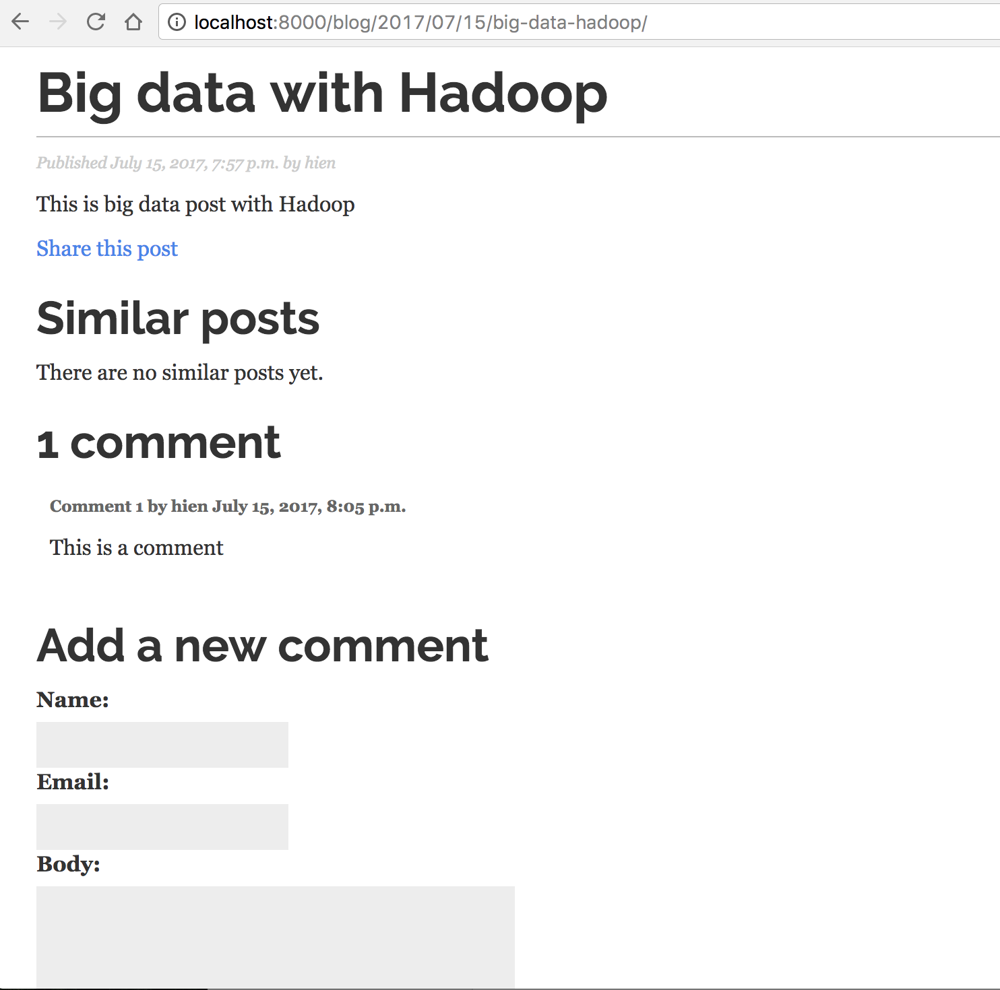
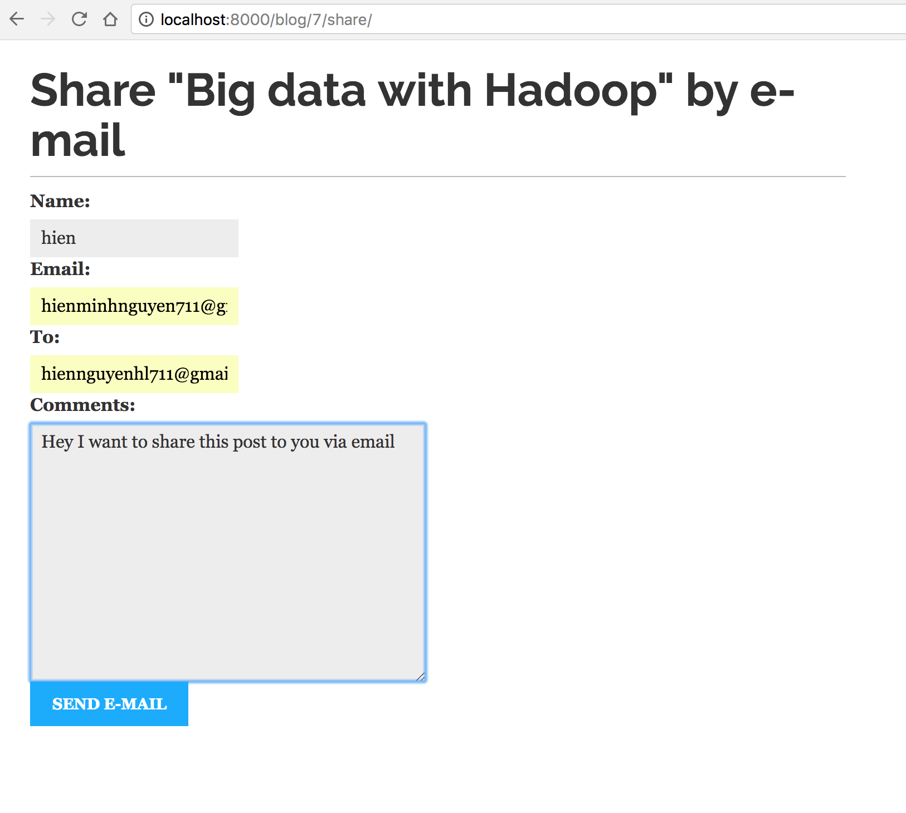

# django-blog-search
A blog app implement Solr search engine

## tech used 
+ Python Django framework(plugins for email sharing, pagination, RSS feed read)
+ Solr search engine

## Demos

## Comments

## Email sharing 

## Solr search query

